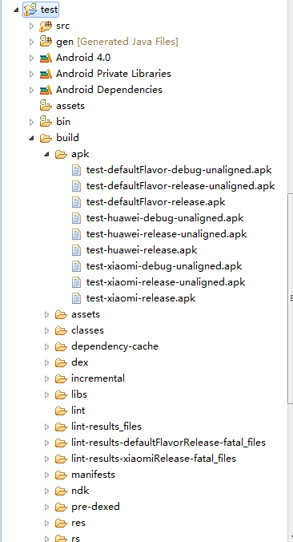

# eclipse中如何用gradle构建android项目
<br/>

## 准备工作
1、下载：首先下载gradle，地址：//www.gradle.org/，这里我用的是gradle1.10，下载的zip文件如下，

解压到指定目录。然后配置环境变量，这里我的解压的指定目录为

E:\gradle-1.10-all\gradle-1.10 

2、配置环境变量 
配置PATH环境变量，如下指定bin文件的目录E:\gradle-1.10-all\gradle-1.10\bin;
 

新建环境变量GRADLE_HOME,配置如下 
  

以上环境变量配置完毕之后进入cmd命令：输入“gradle -v”命令，如果如下展示，说明配置成功 
  

## 正式使用
这里新建个用于测试的test安卓工程。目录如下 
 

首先利用ADT导出build.gradle文件 
 

 

选中要导出文件的工程，这里是选中test，点击next。
  
 

可以看到多了图中箭头标识的文件，右键刷新工程 
 
工程文件更新如下，多出如下几个文件：
 
  

1、先说没有特殊需求的打包，如果仅仅只是需要打测试包的话，则在cmd下cd到当前工程的目录下 
  

输入“gradle clean”命令,显示如下说明clean成功
  

现在开始构建项目，输入“gradle build”,显示如下说明成功 
  
  

右键刷新工程，会出现build文件夹，如下 
  
 
打开apk文件夹，会发现下面有两个apk文件，第一个是debug模式下未对齐的apk，第二个是relase模式下未签名的apk，这两个apk都不是打正式包我们需要的，因为还没有加签名。下面会介绍加签名的包怎么打出来。  
  

2、构建有签名的正式包，先把项目的keystore的文件放到根目录下。 
  

打开build.gradle文件进行配置，在android下面增加signingConfigs 和buildTypes。将其中的keystore相关信息替换成你自己的。
```android
android {
    compileSdkVersion 14
    buildToolsVersion "19.0.3"


    sourceSets {
        main {
            manifest.srcFile 'AndroidManifest.xml'
            java.srcDirs = ['src']
            resources.srcDirs = ['src']
            aidl.srcDirs = ['src']
            renderscript.srcDirs = ['src']
            res.srcDirs = ['res']
            assets.srcDirs = ['assets']
        }
        // Move the tests to tests/java, tests/res, etc...
        instrumentTest.setRoot('tests')
        // Move the build types to build-types/<type>
        // For instance, build-types/debug/java, build-types/debug/AndroidManifest.xml, ...
        // This moves them out of them default location under src/<type>/... which would
        // conflict with src/ being used by the main source set.
        // Adding new build types or product flavors should be accompanied
        // by a similar customization.
        debug.setRoot('build-types/debug')
        release.setRoot('build-types/release')
    }

signingConfigs {
    myConfig {
        storeFile file("szh.keystore")
        storePassword ("这里替换成你自己的")
        keyAlias ("这里替换成你自己的")
        keyPassword ("这里替换成你自己的")
    }
}
   buildTypes{
       release {
    signingConfig  signingConfigs.myConfig
        } 
    }
}
```

再次执行clean和build的命令再次打包，如果成功，刷新工程后会在apk文件夹下出现三个apk文件，如下  
  
最后一个为release版本的进行过zipalign对齐的apk，也就是我们的正式包。这个时候可能会有个问题，我们的签名信息需要保密，不能明文展示，这个时候就需要对签名信息进行处理了。下面会介绍怎么对签名信息进行保密的处理。 

3、打开build.gradle,更改signingConfis里面的内容，把明文展示更改成用键盘输入的方式，这里我的keystore的文件位置和keyAlias不需要保密，明文展示就可以了。如果有需要可以和password一样的处理方式，如下图：   
  

保存重新执行clean命令，会出现如下界面，输入密码  
  

继续输入密码，执行build命令，完成构建操作。  
  

4、如何打多渠道包？我们经常会用到友盟等统计SDK,友盟统计渠道的时候会让我们替换其中的渠道号，如果是这样一个一个替换打包，会相当耗时，gradle提供了很好的取到替换的方法。 
  

打开build.gradle文件

在android下添加以下内容，这里添加xiaomi和huawei两个渠道作为示范，
```android
productFlavors {
    defaultFlavor {
      proguardFile 'proguard-rules.txt'
    }
    // 需要打不同的版本
    xiaomi {
    }
    huawei {
    }
}
```

添加完毕之后，需要在文件中添加替换的方法，如下替换友盟渠道号中的UMENG_CHANNEL_VALUE，当然这个值可以自己定义。(build.gradle文件在附件会给出)  
   

全部更改完成之后再clean和build一次，打开apk文件夹后出现如图所示 
   

xiaomi和huawei两个渠道包就打出来了，现在来检查是不是友盟的渠道号已经更改了，打开manifests文件夹下面的huaweiRelease和xiaomiRelease  
   
   

以上就是eclipse里面用gradle构建android项目的具体实现方法，后面将会介绍有依赖库的情况下如何用gradle构建项目

build.gradle文件如下：
```android
buildscript {
    repositories {
        mavenCentral()
    }
    dependencies {
        classpath 'com.android.tools.build:gradle:0.8.+'
    }
}
apply plugin: 'android'
 
dependencies {
    compile fileTree(dir: 'libs', include: '*.jar')
}
 
android {
    compileSdkVersion 14
    buildToolsVersion "19.0.3"
 
    sourceSets {
        main {
            manifest.srcFile 'AndroidManifest.xml'
            java.srcDirs = ['src']
            resources.srcDirs = ['src']
            aidl.srcDirs = ['src']
            renderscript.srcDirs = ['src']
            res.srcDirs = ['res']
            assets.srcDirs = ['assets']
        }
 
        // Move the tests to tests/java, tests/res, etc...
        instrumentTest.setRoot('tests')
 
        // Move the build types to build-types/<type>
        // For instance, build-types/debug/java, build-types/debug/AndroidManifest.xml, ...
        // This moves them out of them default location under src/<type>/... which would
        // conflict with src/ being used by the main source set.
        // Adding new build types or product flavors should be accompanied
        // by a similar customization.
        debug.setRoot('build-types/debug')
        release.setRoot('build-types/release')
        
        //打包，利用输入框代替写入的密码，为了安全
        signingConfigs {
            myConfig {
                storeFile file("szh.keystore")
                storePassword System.console().readLine("\n\$ Enter keystore password: ")
                keyAlias ("china")
                keyPassword System.console().readLine("\n\$ Enter key password: ")
            }
        }
 
        buildTypes{
            release {
                signingConfig  signingConfigs.myConfig
            } 
        }
 
        productFlavors {
            defaultFlavor {
            proguardFile 'proguard-rules.txt'
            }
            // 需要打不同的版本
            xiaomi {
            }
            huawei {
            }
        }
    }
}
 
//替换AndroidManifest.xml的UMENG_CHANNEL_VALUE字符串为渠道名称
android.applicationVariants.all{ variant -> 
    println "${variant.productFlavors[0].name}"
    variant.processManifest.doLast{
        copy{
            from("${buildDir}/manifests"){
                include "${variant.dirName}/AndroidManifest.xml"
            }
            into("${buildDir}/manifests/$variant.name")
            filter{
                String line -> line.replaceAll("UMENG_CHANNEL_VALUE", "${variant.productFlavors[0].name}").replaceAll("<!--.*?-->", "")
            }
 
            variant.processResources.manifestFile = file("${buildDir}/manifests/${variant.name}/${variant.dirName}/AndroidManifest.xml")
        }    
   }
}
```
