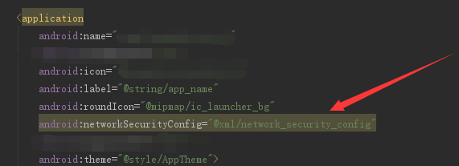

# Android 9.0 http无法访问网络问题
<br/>
9.0系统已经默认不支持http请求了，谷歌默认要求链接是加密链接了，要解决这个问题有几种方案，第一个是把http改成https,这个要让后台更改 

还有一个就是把targetSdkVersion 改成27或者以下。 

还有一个方案就是在res目录添加一个xml文件夹，新建一个xml 

编写： 
```xml
<?xml version="1.0" encoding="utf-8"?>
<network-security-config>
    <base-config cleartextTrafficPermitted="true" />
</network-security-config>
```

在AndroidManifest.xml清单文件上加入 
