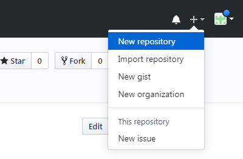
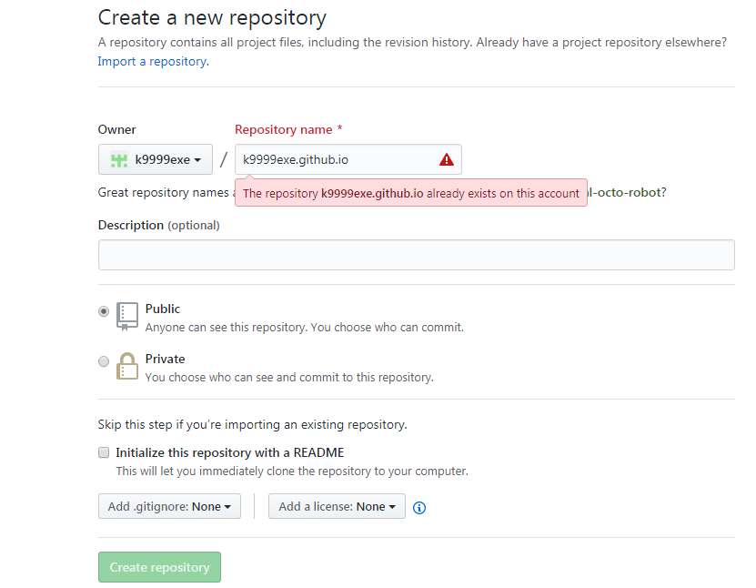
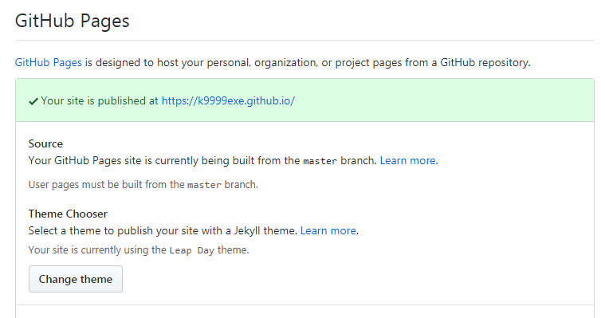
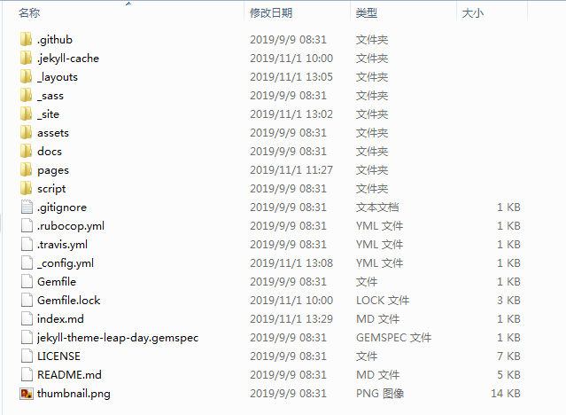

# Github+Jekyll搭建个人博客

GitHub搭建个人博客，详细介绍下github代码托管，jekyll安装，jekyll主题选择，jekyll运行等。


## GitHub代码托管
1.需要在github.com里注册账号

2.创建新的repository



Repository name设置为'账号.github.io'



3.可以在settings里设置自己喜欢的theme



设置后可以在浏览器里输入https://k9999exe.github.io来访问个人搭建博客，需要修改样式可以在仓库里添加index.md文件来设置首页，添加所需整体样式可以添加任意jekyll模板既可以


## jekyll安装

1.下载安装[ruby installer](https://rubyinstaller.org/).

2.点击下载[rubygems](https://rubygems.org/pages/download),解压到任务目录下，并在命令行里进入该目录运行ruby setup.rb

> ruby setup.rb

3.通过gem命令添加jekyll包及bundle包

>gem install jekyll bundle

4.通过jekyll命令创建并运行jekyll项目

>jekyll new myblog
>
>cd myblog
>
>jekyll serve

服务启动后访问http://127.0.0.1:4000访问启动的服务

tips：可以通过

>bundle exec jekyll serve

来访问


## jekyll主题选择

默认创建的模板为简单模板，需要通过[官网下载](http://jekyllthemes.org/)下载使用任意模板。

1.进入[官网下载](http://jekyllthemes.org/)或者[github标准模板库](https://github.com/pages-themes)下载。

2.解压到任意目录下后再命令行里运行jekyll serve来启动服务

3.启动失败时根据提示内容需要安装对应依赖包或者通过bundle install安装依赖包

>bundle install

4.完成后可以上传到https://github.com/k9999exe/k9999exe.github.io仓库里设置自己新的博客样式

## jekyll目录结构

jekyll目录结构主要包含如下目录：



```
_posts 博客内容
_pages 其他需要生成的网页，如About页
_layouts 网页排版模板
_includes 被模板包含的HTML片段，可在_config.yml中修改位置
assets 辅助资源 css布局 js脚本 图片等
_data 动态数据
_sites 最终生成的静态网页
_config.yml 网站的一些配置信息
index.html 网站的入口
```