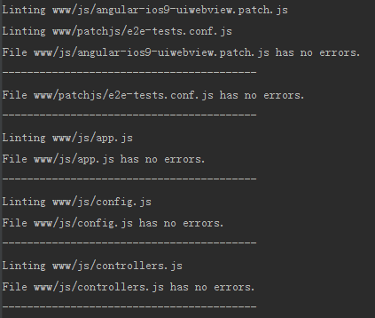
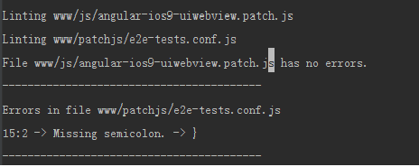

# Angular中的异常机制与异常之外的处理 
<br/>
本文解释了ionic工程发布之前的最后一步，即代码压缩（获取更好的性能）以及代码混淆（以免源码被有心者轻易获取）。包括以下步骤：
* （cordova hook）`检查javascript`：这一步需要在代码压缩和代码混淆之前进行以保证javascript代码无错误
* （gulp task）`将html页面代码转换为angular的JS代码`：这一步起到了混淆html页面代码的作用
* （gulp task）`启用angular严格依赖注入`：这一步需要在代码混淆之前进行以保证angular的依赖注入没有问题
* （gulp task）`组合js代码以及组合css代码`：这一步起到了混淆js代码以及css代码的作用
* （cordova hook）`代码丑化、压缩、混淆`：最后一步 -  

为完成上述任务，我们需要同时使用*gulp tasks*以及*cordova hooks*。当执行`ionic serve`时，*gulp tasks*会被执行。当执行`ionic build android/ios`或`ionic run android/ios`时，*cordova hooks*会被执行。 

首先注意，本文说明的工程目录结构如下，读者需要根据不同的工程进行路径修改： 

```
$PROJECT_DIR/
    hooks/
    www/
        js/
            xxx.js
            ...
        templates/
            login/
                xxx.html
                ...
            register/
                xxx.html
                ...
            .../
                ...
                ...
        index.html
```

---

## 检查javascript
### 1.这一步需要用到jshint以及async，可以使用npm安装：
> $ npm install jshint --save-dev 
> 
> $ npm install async --save-dev 

### 2.复制cordova hooks文件：

将此文件(01_junkcleanup.js, 02_jshint.js)下载，并复制到$PROJECT_DIR/hooks/before_prepare文件夹里。特别注意需要给予此文件"可执行"的权限，即

> $ chmod +x file_name 

注意：此文件负责检测$PROJECT_DIR/www/js/目录下的js文件是否有误，请根据自己工程的实际情况对此文件进行修改: 

如我的工程中有2个存放js文件的路径：$PROJECT_DIR/www/js目录和$PROJECT_DIR/www/patchjs目录，则我需要对上述文件进行如下修改：
```js
var foldersToProcess = [
        'js'
];
```
替换为：

```js
var foldersToProcess = [
        'js', 'patchjs'
];
```

### 3.测试：
终端执行： 
> $ ionic build android/ios

若成功，则可在终端输出中看到工程中js文件是否有错误，并指出错误/警告的行、列数以及错误/警告的原因:  
检查无误： 

   
检查有误： 

 

根据输出提示信息可知www/patchjs/e2e-tests.conf.js文件的第15行的第二列缺失了一个分号。 

注意：js代码中使用eval函数也会导致此项检测报错，建议使用其他方法代替eval函数，如必须使用，可以使用/*jslint evil: true */标注：

```js
/*jslint evil: true */
var temp = eval('(' + JSON.stringify(response) + ')');
```
<br>
## 将html页面代码转换为angular的JS代码
这一步对html页面代码的混淆是将html页面代码处理成angular的js代码（保存到一个js文件中）。 
### 1.这一步需要用到gulp-angular-templatecache。可以使用npm安装：
> npm install gulp-angular-templatecache --save-dev  

### 2.修改gulpfile.js文件：
```js
var templateCache = require('gulp-angular-templatecache');
```
```js
var paths = {
    sass: ['./scss/**/*.scss'],
    templatecache: ['./www/templates/**/*.html']
};
```
```js
gulp.task('templatecache', function (done) {
    gulp.src('./www/templates/**/*.html')
      .pipe(templateCache({standalone:true}))
      .pipe(gulp.dest('./www/js'))
      .on('end', done);
});
```
```js
gulp.task('default', ['sass', 'templatecache']);
```
```js
gulp.task('watch', function() {
  gulp.watch(paths.sass, ['sass']);
  gulp.watch(paths.templatecache, ['templatecache']);
});
```

### 3.修改ionic.project文件：
```
"gulpStartupTasks": [
    "sass",
    "templatecache",
    "watch"
]
```

### 4.在app.js中增加templates模块依赖：
```js
angular.module('starter', ['ionic', 'starter.controllers', 'templates'])
``` 

### 5.在index.html中引入templates.js文件：
```html
<script src="js/templates.js"></script>
```

注意：这里的templates.js文件是下一步生成的。 
### 6.测试：
> $ ionic serve 

或者 

> $ gulp templatecache 

执行完毕，在$PROJECT_DIR/www/js目录下将生成templates.js文件，此文件中将包含对html页面代码的转换结果。

### 7.改变templateUrl路径：
打开$PROJECT_DIR/www/js/templates.js文件，我们可以看到类似于下面的代码：
```js
$templateCache.put("login.html", ...
```
大家可以看到，此时的login.html前面没有templates路径前缀，其他的html文件也是类似的，所以我们之前在js中使用templateUrl指定的html文件路径便需要作出相应变化—-去除templates路径前缀:

首先，我们要知道哪里会使用到templateUrl属性，可能有如下几种情况：

1.app.js中使用$stateProvider.state()定义路由时;

2.类似于$ionicPopover的控件或自定义的directives中到;

我们以情况1为例说明修改的过程：

app.js之前可能的情况：
```js
.state('login', {
	url: "/",
	templateUrl: "templates/login.html",
	controller: 'LoginCtrl'
});
```
修改之后则为：
```js
.state('login', {
	url: "/",
	templateUrl: "login.html",
	controller: 'LoginCtrl'
});
```
其他的也类似地进行修改。

## 启用angular ng-strict-di
在我们进行代码压缩之前，我们需要启用angular的ng-strict-di，即严格依赖注入，使用ng-strict-di使得工程中依赖注入不会有问题，更多关于ng-strict-di可以看[这里](https://github.com/olov/ng-annotate#highly-recommended-enable-ng-strict-di-in-your-minified-builds)。

### 1.首先通过npm安装gulp-ng-annotate：
> $ npm install gulp-ng-annotate --save-dev 

### 2.其次，修改gulpfile.js文件：
```js
var ngAnnotate = require('gulp-ng-annotate');
```
```js
var paths = {
    sass: ['./scss/**/*.scss'],  
    templatecache: ['./www/templates/**/*.html'],  
    ng_annotate: ['./www/js/*.js']
};
```
```js
gulp.task('ng_annotate', function (done) {
    gulp.src('./www/js/*.js')
      .pipe(ngAnnotate({single_quotes: true}))
      .pipe(gulp.dest('./www/dist/dist_js/app'))
      .on('end', done);
});
```
```js
gulp.task('default', ['sass', 'templatecache', 'ng_annotate']);
```
```js
gulp.task('watch', function() {
    gulp.watch(paths.sass, ['sass']);
    gulp.watch(paths.templatecache, ['templatecache']);
    gulp.watch(paths.ng_annotate, ['ng_annotate']);
});
```

### 3.修改ionic.project文件：
```
"gulpStartupTasks": [
    "sass",
    "templatecache",
    "ng_annotate",
    "watch"
]
```

### 4.重新定位index.html里js的文件：
```html
<script src="dist/dist_js/app/app.js"></script>  
<script src="dist/dist_js/app/controllers.js"></script>  
<script src="dist/dist_js/app/services.js"></script>  
<script src="dist/dist_js/app/templates.js"></script>
```

### 5.在ng-app标签下加入directive:ng-strict-di：
```html
<body ng-app="your-app" ng-strict-di>
```

### 6.测试
> $ ionic serve 

或

> $ gulp ng_annotate

上面的执行过程将会生成$PROJECT_DIR/www/dist/dist_js/app文件夹，并且其中包含了严格符合注入标准的工程js文件。

## 合并js文件以及css文件

### 1.通过npm安装gulp-useref：
> $ npm install gulp-useref --save-dev

### 2.其次，修改gulpfile.js文件：
```js
var useref = require('gulp-useref');
```
```js
var paths = {
    sass: ['./scss/**/*.scss'],  
    templatecache: ['./www/templates/**/*.html'],  
    ng_annotate: ['./www/js/*.js'],  
    useref: ['./www/*.html']
};
```
```js
gulp.task('useref', function (done) {
    var assets = useref.assets();
    gulp.src('./www/*.html')
      .pipe(assets)
      .pipe(assets.restore())
      .pipe(useref())
      .pipe(gulp.dest('./www/dist'))
      .on('end', done);
});
```
```js
gulp.task('default', ['sass', 'templatecache', 'ng_annotate', 'useref']);
```
```js
gulp.task('watch', function() {
    gulp.watch(paths.sass, ['sass']);
    gulp.watch(paths.templatecache, ['templatecache']);
    gulp.watch(paths.ng_annotate, ['ng_annotate']);
    gulp.watch(paths.useref, ['useref']);
});
```

### 3.修改ionic.project文件：
```
"gulpStartupTasks": [
    "sass",
    "templatecache",
    "ng_annotate",
    "useref",
    "watch"
]
```

### 4.修改index.html文件，对需要合并的js文件和css文件进行处理：
```html
<!-- build:css dist_css/styles.css -->
  <link href="css/ionic.app.css" rel="stylesheet">
<!-- endbuild -->
```
```html
<!-- build:js dist_js/app.js -->  
<script src="dist/dist_js/app/app.js"></script>  
<script src="dist/dist_js/app/controllers.js"></script>  
<script src="dist/dist_js/app/services.js"></script>  
<script src="dist/dist_js/app/templates.js"></script>  
<!-- endbuild --> 
```

注意：可能有些外部的css文件或js文件不想被处理，那么就保持原状即可。

### 5.测试
> $ ionic serve

或

> $ gulp useref 

上面的执行过程会生成以下文件： 

$PROJECT_DIR/www/dist/index.html 

$PROJECT_DIR/www/dist/dist_css/styles.css 

$PROJECT_DIR/www/dist/dist_js/app.js 

其中后面2个文件，即是被合并过后的文件。

注意：新版本的gulp-useref没有assets()方法，所以可能会出现错误，大家可以用gulp-useref的2.1.0版本，即第一步安装时使用：

> $ npm install gulp-useref@2.1.0 --save-dev

## 最后一步
### 1.使用npm安装cordova-uglify以及mv：
> $ npm install cordova-uglify --save-dev 
>
> $ npm instal mv --save-dev

### 2.复制cordova hooks文件：
将这些文件(02_environment_config.js,020_remove_sass_from_platforms.js,030_clean_dev_files_from_platforms.js, 040_move_dist_files_to_platforms.js,050_clean_obfuscation.js, 060_uglify.js)添加至$PROJECT_DIR/hooks/after_prepare文件夹中。并且要注意这些文件中的有关路径的操作，是对应于前几步中的路径的，如果工程结构不一样，请自行调整这些文件中有关路径的部分。特别注意需要给予此文件“可执行”的权限，即

> $ chmod +x file_name
 
现在，我们就可以生成处理完成的文件了：

> $ ionic build android/ios