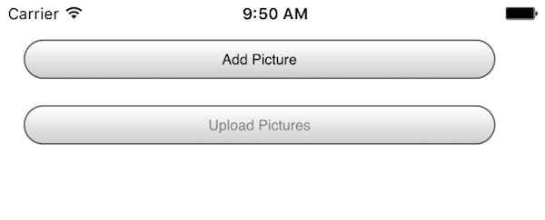
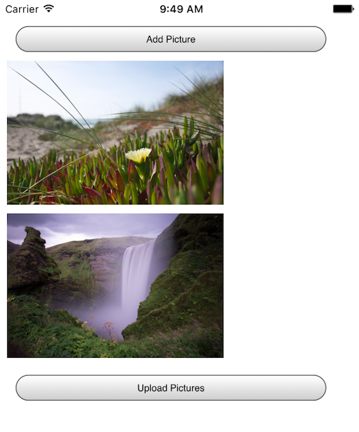

# Uploading multiple files at once - for Cordova
<br/>

Basically we’ve got an app with 2 buttons - select a picture and upload.


 

When you select a picture, it is ‘drawn’ onto the app so you can see what you will be uploading.


  

All of this code can be found on the earlier blog entry so I won’t go over it again. Instead, let’s focus on the upload part. 

We’ve got an array of image URIs that represent paths on the device file system. My initial plan was to loop over the array and create File objects from each URI. My first draft was something like this: 

```js

function uploadPics() {
	console.log("Ok, going to upload "+images.length+" images.");
	var defs = [];
	
	var fd = new FormData();
	
	images.forEach(function(i) {
		console.log('processing '+i);
		var def = $.Deferred();

		window.resolveLocalFileSystemURL(i, function(fileEntry) {
			console.log('got a file entry');
			fileEntry.file(function(file) {
				console.log('now i have a file ob');
				console.dir(file);
				fd.append('file', file);
				def.resolve();
			}, function(e) {
				console.log('error getting file', e);
			});			
		}, function(e) {
			console.log('Error resolving fs url', e);
		});

		defs.push(def.promise());
			
	});

	$.when.apply($, defs).then(function() {
		console.log("all things done");
		var request = new XMLHttpRequest();
		request.open('POST', 'http://192.168.5.13:3000/upload');
		request.send(fd);
	});

}
```

Basically we turn the URL into a FileEntry object and then turn that into a File object because the FileSystem has to be complex so we can all keep our jobs. The crucial part is this: fd.append('file',file). This should have worked exactly like the code from yesterday’s post. However, something weird happened. When the post was sent, my Node server never got any file data. When I used dev tools to inspect the network data, I saw this:

```

------WebKitFormBoundaryCvgXBJta2kHYiUd9
Content-Disposition: form-data; name="file"

[object Object]
------WebKitFormBoundaryCvgXBJta2kHYiUd9--
```

For some reason toString was being called on the File object when passed to Form data. I then tried to pass a blob:

```js
fd.append('file', file.slice(0,file.size));
```

But that failed too. I did some searching and came across the solution (I’ll credit them at the end!) - using a blob was right, but I really needed to use a FileReader to get the data. Now - I thought my file.slice code was doing the same, but… I don’t know. It just didn’t work. Adding in a FileReader finally did it. Here is the final part of the code (with another modification I’ll explain in a bit as well):

```js

function uploadPics() {
	console.log("Ok, going to upload "+images.length+" images.");
	var defs = [];
	
	var fd = new FormData();
	
	images.forEach(function(i) {
		console.log('processing '+i);
		var def = $.Deferred();

		window.resolveLocalFileSystemURL(i, function(fileEntry) {
			console.log('got a file entry');
			fileEntry.file(function(file) {
				console.log('now i have a file ob');
				console.dir(file);
				var reader = new FileReader();
				reader.onloadend = function(e) {
					var imgBlob = new Blob([this.result], { type:file.type});
					fd.append('file'+(images.indexOf(i)+1), imgBlob);
					fd.append('fileName'+(images.indexOf(i)+1), file.name);
					def.resolve();
				};
				reader.readAsArrayBuffer(file);
				
			}, function(e) {
				console.log('error getting file', e);
			});			
		}, function(e) {
			console.log('Error resolving fs url', e);
		});

		defs.push(def.promise());
			
	});

	$.when.apply($, defs).then(function() {
		console.log("all things done");
		var request = new XMLHttpRequest();
		request.open('POST', 'http://192.168.5.13:3000/upload');
		request.send(fd);
	});

}
```
Ok, so you can see the FileReader in play so I’ve got one more level of callback hell, but this isn’t too bad (more like Callback Heck).

Edit on May 9th: Please see Akash’s comment where he noted the third argument to FormData.append allows you to specify a file name. I missed that! It should be used instead of my workaround here.

One thing I discovered though was that my Node server wasn’t getting a good file name - it showed up as ‘blob’. I added a new form field called fileNameX (X being an index) that included the file name. So on the server I have fileX which is the actual file and fileNameX which is the file name. Unfortunately, Android passes ‘content’ as the name. I decided to stop messing with the code at that point. You could add a bit of logic in there to rename it client-side or even do it server-side (perhaps a simple UUID). But I can confirm it works in both Android and iOS.

You can find the full source code here: [https://github.com/cfjedimaster/Cordova-Examples/tree/master/multiupload2](https://github.com/cfjedimaster/Cordova-Examples/tree/master/multiupload2)