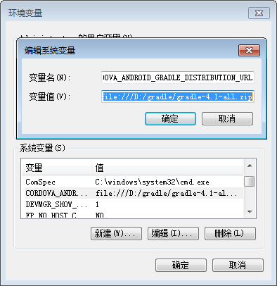
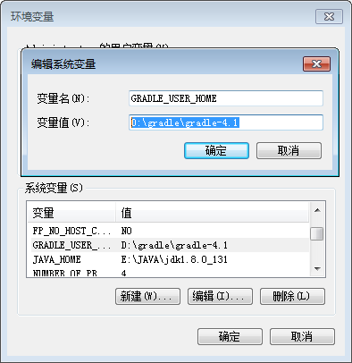
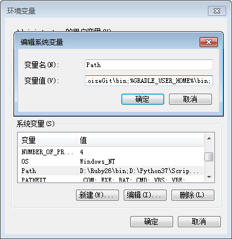

# cordova run android 相关配置
<br/>
cordova run android时需要下载android工程模板以及对应gradle，但gradle默认配置是distributionUrl为官网地址，以至于编译时需要较长时间。

下面介绍本地配置gradle的方法

## 下载Gradle
1. 在[gradle官网](https://gradle.org/releases/)下载gradle4.1版本
2. 解压zip到任意文件夹下
3. 配置环境变量并添加到path里

### 环境变量

变量名：CORDOVA_ANDROID_GRADLE_DISTRIBUTION_URL

变量值：file:///D:/gradle/gradle-4.1-all.zip
* * *
变量名：GRADLE_USER_HOME

变量值：D:\gradle\gradle-4.1

* * *

%GRADLE_USER_HOME%\bin

* * *





```
当cordova add android@6.1.2是 需要下载gradle3.3版本并在环境变量里配置gradle3.3版本
```