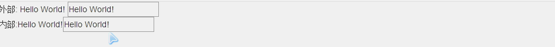
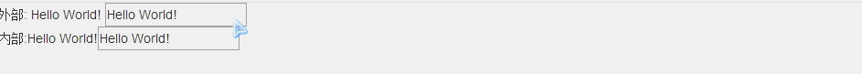
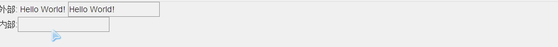

# Angularjs 指令
<br/>

各个参数的作用及用法 

```js
angular.module('myApp', []) 
.directive('myDirective', function() { 
    return { 
      restrict: String, 
      priority: Number, 
      terminal: Boolean, 
      template: String or Template Function:  function(tElement, tAttrs) {...}, 
      templateUrl: String, 
      replace: Boolean or String, 
      scope: Boolean or Object, 
      transclude: Boolean, 
      controller: String or 
      function(scope, element, attrs, transclude, otherInjectables) { ... }, 
      controllerAs: String, 
      require: String, 
      link: function(scope, iElement, iAttrs) { ... }, 
      compile: // 返回一个对象或连接函数，如下所示：
        function(tElement, tAttrs, transclude) { 
        return { 
            pre: function(scope, iElement, iAttrs, controller) { ... }, 
            post: function(scope, iElement, iAttrs, controller) { ... } 
          } 
        return function postLink(...) { ... } 
      } 
    }; 
 });
```
<br />
### restrict[string]

restrict是一个可选的参数。用于指定该指令在DOM中以何种形式被声明。默认值是A，即以属性的形式来进行声明。
可选值如下：

E（元素） 
> `<my-directive></my-directive> `

A（属性，默认值）
> `<div my-directive="expression"></div>`

C（类名） 
> `<div class="my-directive:expression;"></div> `

M（注释） 
> `<--directive:my-directive expression-->`

```
JSCode:
angular.module('app',[])
    .directive('myDirective', function () {
            return { 
                restrict: 'E', 
                template: '<a href="http://www.baidu.com">百度</a>' 
            };
        })
HtmlCode:
 <my-directive></my-directive>
```

### priority[int]
大多数指令会忽略这个参数，使用默认值0，但也有些场景设置高优先级是非常重要甚至是必须的。例如，ngRepeat将这个参数设置为1000，这样就可以保证在同一元素上，它总是在其他指令之前被调用。

### terminal[bool]
这个参数用来停止运行当前元素上比本指令优先级低的指令。但同当前指令优先级相同的指令还是会被执行。

例如：ngIf的优先级略高于ngView（它们操控的实际就是terminal参数），如果ngIf的表达式值为true，ngView就可以被正常执行，但如果ngIf表达式的值为false，由于ngView的优先级较低就不会被执行。

### template[string or function]
template参数是可选的，必须被设置为以下两种形式之一：
*  一段HTML文本；
* 一个可以接受两个参数的函数，参数为tElement和tAttrs，并返回一个代表模板的字符串。tElement和tAttrs中的t代表template，是相对于instance的。

```js
angular.module('app',[])
.directive('myDirective', function () {
  return { 
    restrict: 'EAC', 
    template: function (elem, attr) {
      return "<a href='" + attr.value + "'>" + attr.text + "</a>";
    }
  };
})
```
```html
<my-directive value="http://www.baidu.com" text="百度"></my-directive>
<div my-directive value="http://www.baidu.com" text="百度"></div>
```

### templateUrl[string or function]
templateUrl是可选的参数，可以是以下类型：
* 一个代表外部HTML文件路径的字符串；
* 一个可以接受两个参数的函数，参数为tElement和tAttrs，并返回一个外部HTML文件路径的字符串。

无论哪种方式，模板的URL都将通过ng内置的安全层，特别是$getTrustedResourceUrl，这样可以保护模板不会被不信任的源加载。 默认情况下，调用指令时会在后台通过Ajax来请求HTML模板文件。加载大量的模板将严重拖慢一个客户端应用的速度。为了避免延迟，可以在部署应用之前对HTML模板进行缓存。

```js
angular.module('app',[])
.directive('myDirective', function () {
  return { 
    restrict: 'AEC', 
    templateUrl: function (elem, attr) {
      return attr.value + ".html";  //当然这里我们可以直接指定路径，同时在模板中可以包含表达式
    }
  };
})
```
### replace[bool]
replace是一个可选参数，如果设置了这个参数，值必须为true，因为默认值为false。默认值意味着模板会被当作子元素插入到调用此指令的元素内部,
例如上面的示例默认值情况下，生成的html代码如下：

> `<my-directive value="http://www.baidu.com" text="百度"><a href="http://www.baidu.com">百度</a></my-directive>`

如果设置replace=true

> `<a href="http://www.baidu.com" value="http://www.baidu.com" text="百度">百度</a>`

这种效果只有设置restrict="E"的情况下，才会表现出实际效果。

### scope参数[bool or object]
scope参数是可选的，可以被设置为true或一个对象。默认值是false。
```html
<div ng-app="app" ng-init="name= '祖父'">
  <div ng-init="name='父亲'">
      第一代：{{ name }}
      <div ng-init="name= '儿子'" ng-controller="SomeController">
          第二代： {{ name }}
          <div ng-init="name='孙子'">
              第三代： {{ name }}
          </div>
      </div>
  </div>
</div>
```
第一代，初始化name为父亲,但是第二代和第三代其实是一个作用域，那么他们的name其实是一个对象，因此出现的效果如下：
> 第一代：父亲
> 
> 第二代： 孙子
> 
> 第三代： 孙子

在修改一下代码，把第三代隔离开来再看看效果：
```html
<div ng-app="app"ng-init="name= '祖父'">
  <div ng-init="name='父亲'">
      第一代：{{ name }}
      <div ng-init="name= '儿子'" ng-controller="SomeController">
          第二代： {{ name }}
          <div ng-init="name='孙子'" ng-controller="SecondController">
            第三代： {{ name }}
          </div>
      </div>
  </div>
</div>
```
```js
angular.module('app', [])
.controller('SomeController',function($scope) {
    
})
.controller('SecondController', function ($scope) {

})
```
> 第一代：父亲
> 
> 第二代： 孙子
> 
> 第三代： 孙子

修改下代码来看看继承：
```html
<div ng-app="app"ng-init="name= '祖父的吻'">
  <div>
    第一代：{{ name }}
    <div ng-controller="SomeController">
        第二代： {{ name }}
        <div  ng-controller="SecondController">
          第三代： {{ name }}
        </div>
    </div>
  </div>
</div>
```
> 第一代：祖父的吻
> 
> 第二代： 祖父的吻
> 
> 第三代： 祖父的吻

再来看个例子：
```js
angular.module('myApp', [])
.controller('MainController', function ($scope) {
})
.directive('myDirective', function () {
  return {
    restrict: 'A',
    scope:false,//切换为{}，true测试
    priority: 100,
    template: '<div>内部:{{ myProperty }}<input ng-model="myProperty"/></div>'
  };
});
```
```html
<div ng-controller='MainController' ng-init="myProperty='Hello World!'">
  外部: {{ myProperty}}
  <input ng-model="myProperty" />
  <div my-directive></div>
</div>
```

当我们改变scope的值

false:继承但不隔离



true:继承并隔离



{}：隔离且不继承



### transclude
transclude是一个可选的参数。默认值是false。嵌入通常用来创建可复用的组件，典型的例子是模态对话框或导航栏。我们可以将整个模板，包括其中的指令通过嵌入全部传入一个指令中。指令的内部可以访问外部指令的作用域，并且模板也可以访问外部的作用域对象。为了将作用域传递进去，scope参数的值必须通过{}或true设置成隔离作用域。如果没有设置scope参数，那么指令内部的作用域将被设置为传入模板的作用域。

导航栏例子：
```html
<div side-box title="TagCloud">
  <div class="tagcloud">
    <a href="">Graphics</a>
    <a href="">ng</a>
    <a href="">D3</a>
    <a href="">Front-end</a>
    <a href="">Startup</a>
  </div>
</div>
```
```js
angular.module('myApp', []) 
 .directive('sideBox', function() { 
  return { 
    restrict: 'EA', 
    scope: { 
        title: '@' 
    }, 
    transclude: true, 
    template: '<div class="sidebox"><div class="content"><h2 class="header">' +
        '{{ title }}</h2><span class="content" ng-transclude></span></div></div>' 
    }; 
});
```
这段代码告诉ng编译器，将它从DOM元素中获取的内容放到它发现ng-transclude指令的地方。

再来你看个官网的例子：
```js
angular.module('docsIsoFnBindExample', [])
.controller('Controller', ['$scope', '$timeout', function($scope, $timeout) {
  $scope.name = 'Tobias';
  $scope.hideDialog = function () {
    $scope.dialogIsHidden = true;
    $timeout(function () {
      $scope.dialogIsHidden = false;
    }, 2000);
  };
}])
.directive('myDialog', function() {
  return {
    restrict: 'E',
    transclude: true,
    scope: {
      'close': '&onClose'
    },
    templateUrl: 'my-dialog-close.html'
  };
});
```
my-dialog-close.html
```html
<div class="alert">
  <a href class="close" ng-click="close()">&times;</a>
  <div ng-transclude></div>
</div>
```
index.html
```html
<div ng-controller="Controller">
  <my-dialog ng-hide="dialogIsHidden" on-close="hideDialog()">
    Check out the contents, {{name}}!
  </my-dialog>
</div>
```

### controller[string or function]
 controller参数可以是一个字符串或一个函数。当设置为字符串时，会以字符串的值为名字，来查找注册在应用中的控制器的构造函数.
```js
angular.module('myApp', []) 
.directive('myDirective', function() { 
  restrict: 'A',  
  controller: 'SomeController' 
}) 
```
```js
angular.module('myApp',[]) 
.directive('myDirective', function() { 
  restrict: 'A', 
  controller: 
  function($scope, $element, $attrs, $transclude) { 
  // 控制器逻辑放在这里
} 
});
```
我们可以将任意可以被注入的ng服务注入到控制器中，便可以在指令中使用它了。控制器中也有一些特殊的服务可以被注入到指令当中。这些服务有：


1.$scope

与指令元素相关联的当前作用域。

2.$element

当前指令对应的元素。

3.$attrs

由当前元素的属性组成的对象。 


```html
<div id="aDiv"class="box"></div>
具有如下的属性对象：
{ 
id: "aDiv", 
class: "box" 
}
```
4.$transclude 

嵌入链接函数会与对应的嵌入作用域进行预绑定。transclude链接函数是实际被执行用来克隆元素和操作DOM的函数。

```js
angular.module('myApp',[])
.directive('myLink', function () {
  return {
    restrict: 'EA',
    transclude: true,
    controller:
    function ($scope, $element,$attrs,$transclude) {
        $transclude(function (clone) {              
          var a = angular.element('<a>');
          a.attr('href', $attrs.value);
          a.text(clone.text());
          $element.append(a);
        });
    }
  };
});
```
```html
<my-link value="http://www.baidu.com">百度</my-link>
<div my-link value="http://www.google.com">谷歌</div>
```
### controllerAs[string]
controllerAs参数用来设置控制器的别名，这样就可以在视图中引用控制器甚至无需注入$scope。
```html
<div ng-controller="MainController as main">
  <input type="text" ng-model="main.name" />
  <span>{{ main.name }}</span>
</div> 
```
```js
angular.module('myApp',[])
.controller('MainController', function () {
  this.name = "Halower";
});
```

### require[string or string[]]
require为字符串代表另外一个指令的名字。require会将控制器注入到其所指定的指令中，并作为当前指令的链接函数的第四个参数。字符串或数组元素的值是会在当前指令的作用域中使用的指令名称。在任何情况下，ng编译器在查找子控制器时都会参考当前指令的模板。 


* 如果不使用^前缀，指令只会在自身的元素上查找控制器。指令定义只会查找定义在指令作当前用域中的ng-model=""
* 如果使用?前缀,在当前指令中没有找到所需要的控制器，会将null作为传给link函数的第四个参数。
* 如果添加了^前缀，指令会在上游的指令链中查找require参数所指定的控制器。
* 如果添加了?^ 将前面两个选项的行为组合起来，我们可选择地加载需要的指令并在父指令链中进行查找
* 如果没有任何前缀，指令将会在自身所提供的控制器中进行查找，如果没有找到任何控制器（或具有指定名字的指令）就抛出一个错误 

### compile[object or function]
compile选项本身并不会被频繁使用，但是link函数则会被经常使用。本质上，当我们设置了link选项，实际上是创建了一个postLink() 链接函数，以便compile() 函数可以定义链接函数。通常情况下，如果设置了compile函数，说明我们希望在指令和实时数据被放到DOM中之前进行DOM操作，在这个函数中进行诸如添加和删除节点等DOM操作是安全的。 

### link
```js
compile: function(tEle, tAttrs, transcludeFn) {
 //todo:
 return function(scope, ele, attrs) {
 // 链接函数
};
```
链接函数是可选的。如果定义了编译函数，它会返回链接函数，因此当两个函数都定义时，编译函数会重载链接函数。如果我们的指令很简单，并且不需要额外的设置，可以从工厂函数（回调函数）返回一个函数来代替对象。如果这样做了，这个函数就是链接函数。

### ngModel

1.为了设置作用域中的视图值，需要调用 ngModel.$setViewValue() 函数。 

$setViewValue() 方法适合于在自定义指令中监听自定义事件（比如使用具有回调函数的jQuery插件），我们会希望在回调时设置$viewValue并执行digest循环。
```js
angular.module('myApp')
.directive('myDirective', function() {
  return {
    require: '?ngModel',
    link: function(scope, ele, attrs, ngModel) {
      if (!ngModel) return;
      $(function() {
        ele.datepicker({
          //回调函数
          onSelect: function(date) {
            // 设置视图和调用 apply
            scope.$apply(function() {
                ngModel.$setViewValue(date);
            });
          }
        });
      });
    }
  };
});
```
2.$render方法可以定义视图具体的渲染方式 

3.属性

1. $viewValue
$viewValue属性保存着更新视图所需的实际字符串。
2. $modelValue
$modelValue由数据模型持有。 $modelValue和$viewValue可能是不同的，取决于$parser流水线是否对其进行了操作。
3. $parsers
$parsers 的值是一个由函数组成的数组，其中的函数会以流水线的形式被逐一调用。ngModel 从DOM中读取的值会被传入$parsers中的函数，并依次被其中的解析器处理。
4. $formatters
$formatters的值是一个由函数组成的数组，其中的函数会以流水线的形式在数据模型的值发生变化时被逐一调用。它和$parser流水线互不影响，用来对值进行格式化和转换，以便在绑定了这个值的控件中显示。
5. $viewChangeListeners
$viewChangeListeners的值是一个由函数组成的数组，其中的函数会以流水线的形式在视图中的值发生变化时被逐一调用。通过$viewChangeListeners，可以在无需使用$watch的情况下实现类似的行为。由于返回值会被忽略，因此这些函数不需要返回值。
6. $error
$error对象中保存着没有通过验证的验证器名称以及对应的错误信息。
7. $pristine
$pristine的值是布尔型的，可以告诉我们用户是否对控件进行了修改。
8. $dirty
$dirty的值和$pristine相反，可以告诉我们用户是否和控件进行过交互。
9. $valid
$valid值可以告诉我们当前的控件中是否有错误。当有错误时值为false， 没有错误时值为true。
10. $invalid
$invalid值可以告诉我们当前控件中是否存在至少一个错误，它的值和$valid相反。