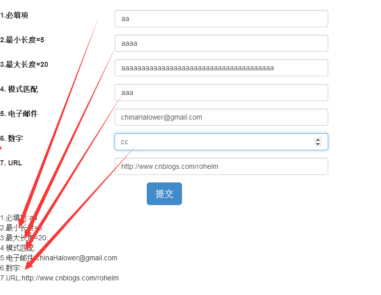
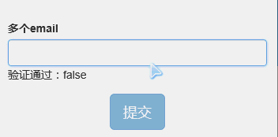

# Angularjs 表单验证 
<br/>

常用的表单验证指令  

### 1. 必填项验证 

某个表单输入是否已填写，只要在输入字段元素上添加HTML5标记required即可：

> `<input type="text" required />`

### 2. 最小长度 

验证表单输入的文本长度是否大于某个最小值，在输入字段上使用指令ng-minleng= "{number}"：

> `<input type="text" ng-minlength="5" /> `

### 3. 最大长度 

验证表单输入的文本长度是否小于或等于某个最大值，在输入字段上使用指令ng-maxlength="{number}"：

> `<input type="text" ng-maxlength="20" />`

### 4. 模式匹配 

使用ng-pattern="/PATTERN/"来确保输入能够匹配指定的正则表达式：

> `<input type="text" ng-pattern="/[a-zA-Z]/" /> `

### 5. 电子邮件 

验证输入内容是否是电子邮件，只要像下面这样将input的类型设置为email即可：

> `<input type="email" name="email" ng-model="user.email" /> `

### 6. 数字 

验证输入内容是否是数字，将input的类型设置为number：

> `<input type="number" name="age" ng-model="user.age" /> `

### 7. URL 

验证输入内容是否是URL，将input的类型设置为 url：

> `<input type="url" name="homepage" ng-model="user.facebook_url" />`

```html
<div class="col-md-6">
  <form role="form" class="form-horizontal">
      <div class="form-group">
          <div class="col-md-4">
              <label for="name">1.必填项</label>
          </div>
          <div class="col-md-8">
              <input class="form-control" id="name" type="text" required ng-model='user.name' />
          </div>
      </div>
      <div class="form-group">
          <div class="col-md-4">
              <label for="minlength">2.最小长度=5</label>
          </div>
          <div class="col-md-8">
              <input type="text" id="minlength" ng-minlength="5" ng-model="user.minlength" class="form-control" />
          </div>
      </div>
      <div class="form-group">
          <div class="col-md-4">
              <label for="minlength">3.最大长度=20</label>
　　　　　　　　　　</div>
          <div class="col-md-8">
              <input type="text" ng-model="user.maxlength" ng-maxlength="20" class="form-control" />
          </div>
      </div>
      <div class="form-group">
          <div class="col-md-4">
              <label for="minlength">4. 模式匹配</label>
          </div>
          <div class="col-md-8">
            <input type="text" id="minlength" ng-model="user.pattern" ng-pattern="/^[a-zA-Z]*\d$/" class="form-control" />
          </div>
      </div>
      <div class="form-group">
          <div class="col-md-4">
              <label for="email">5. 电子邮件</label>
　　　　　　　　　　</div>
          <div class="col-md-8">
              <input type="email" id="email" name="email" ng-model="user.email" class="form-control" />
          </div>
      </div>
      <div class="form-group">
          <div class="col-md-4">
              <label for="age">6. 数字</label>
　　　　　　　　　　</div>
          <div class="col-md-8">
              <input type="number" id="age" name="age" ng-model="user.age" class="form-control" />
          </div>
      </div>
      <div class="form-group">
          <div class="col-md-4">
              <label for="url"> 7. URL</label>
　　　　　　　　　　</div>
          <div class="col-md-8">
              <input type="url" id="url" name="homepage" ng-model="user.url" class="form-control" />
          </div>
      </div>
      <div class="form-group text-center">
          <input class="btn btn-primary btn-lg" type="submit" value="提交" />
      </div>
  </form>       
</div>
<div class="col-md-12">
  1.必填项:{{user.name}}<br>
  2.最小长度=5:{{user.minlength}}<br>
  3.最大长度=20:{{user.maxlength}}<br>
  4.模式匹配:{{user.pattern}}<br>
  5.电子邮件:{{user.email}}<br>
  6.数字:{{user.age}}<br>
  7.URL:{{user.url}}<br>
</div>
```

在测试中我们发现，只有当表达式满足验证，才会实时进行双向绑定。同时我们也发现，效果图如下：

 

似乎并没有发生什么问题，但是如果我们将其移植到一个队HTML5验证不怎么好的浏览器再来测试一下【本例IE9】，问题来了，某些字段完全没得验证

 

其实，上面的例子，我们利用了HTML5的验证与ng自有的验证进行了结合，不支持HTML5验证，但ng自由验证运行良好。解决方案很简单，可以使用模式匹配的方式解决这几种情况，也可以自定义验证指令来复写或者重定义验证规则。

屏蔽浏览器对表单的默认验证行为


在表单元素上添加novalidate标记即可，问题是我们怎么知道我们的表单有哪些字段是有效的，那些事非法或者无效的？ng对此也提供了非常棒的解决方案，表单的属性可以在其所属的$scope对象中访问到，而我们又可以访问$scope对象，因此JavaScript可以间接地访问DOM中的表单属性。借助这些属性，我们可以对表单做出实时响应。

可以使用formName.inputFieldName.property的格式访问这些属性。

### 未修改过的表单

布尔值属性，表示用户是否修改了表单。如果为ture，表示没有修改过；false表示修改过：

> `formName.inputFieldName.$pristine;`

### 修改的表单

布尔型属性，当且仅当用户实际已经修改的表单。不管表单是否通过验证：

> `formName.inputFieldName.$dirty`


### 经过验证的表单

布尔型属性，它指示表单是否通过验证。如果表单当前通过验证，他将为true：

> `formName.inputFieldName.$valid`


### 未通过验证的表单

> `formName.inputFieldName.$invalid`


最后两个属性在用于DOM元素的显示或隐藏时是特别有用的。同时，如果要设置特定的class时，他们也非常有用的。

### 错误

这是AngularJS提供的另外一个非常有用的属性：$error对象。它包含当前表单的所有验证内容，以及它们是否合法的信息。用下面的语法访问这个属性

> `formName.inputfieldName.$error`

如果验证失败，这个属性的值为true；如果值为false，说明输入字段的值通过了验证。

对这些验证指令进行测试：

```html
<!DOCTYPE html>

<html ng-app="myTest">
    <head>
        <meta name="viewport" content="width=device-width" />
        <title>Index</title>
        <link href="~/Content/css/bootstrap.min.css" rel="stylesheet" />
        <script src="~/Javascript/angular.min.js"> </script>
        <style type="text/css">
            body { padding-top: 30px; }
        </style>
    </head>
    <body  ng-Controller="MyController">
        <div class="col-md-6">
            <form role="form" name="myForm" ng-submit="submitForm(myForm.$valid)" class="form-horizontal" novalidate>
                <div class="form-group  has-feedback">
                    <div class="col-md-4">
                        <label for="name">1.必填项</label>
                    </div>
                    <div class="col-md-8">
                        <input class="form-control" id="name" name="name" type="text" required ng-model='user.name' />
                        <span class="glyphicon glyphicon-ok form-control-feedback"
                              ng-show="myForm.name.$dirty && myForm.name.$valid"></span>
                    </div>
                </div>
                <div class="form-group  has-feedback">
                    <div class="col-md-4">
                        <label for="minlength">2.最小长度=5</label>
                    </div>
                    <div class="col-md-8">
                        <input type="text" id="minlength" name="minlength" ng-minlength="5" ng-model="user.minlength" class="form-control" />
                        <span class="glyphicon glyphicon-ok form-control-feedback"
                              ng-show="myForm.minlength.$dirty && myForm.minlength.$valid"></span>
                    </div>
                </div>
                <div class="form-group  has-feedback">
                    <div class="col-md-4">
                        <label for="maxlength">3.最大长度=20</label>
                    </div>
                    <div class="col-md-8">
                        <input type="text" id="maxlength" name="maxlength" ng-model="user.maxlength" ng-maxlength="20" class="form-control" />
                        <span class="glyphicon glyphicon-ok form-control-feedback"
                              ng-show="myForm.maxlength.$dirty && myForm.maxlength.$valid"></span>
                    </div>
                </div>
                <div class="form-group  has-feedback">
                    <div class="col-md-4">
                        <label for="pattern">4. 模式匹配</label>
                    </div>
                    <div class="col-md-8">
                        <input type="text" id="pattern" name="pattern" ng-model="user.pattern" ng-pattern="/^[a-zA-Z]*\d$/" class="form-control" />
                        <span class="glyphicon glyphicon-ok form-control-feedback"
                              ng-show="myForm.pattern.$dirty && myForm.pattern.$valid"></span>
                    </div>
                </div>
                <div class="form-group  has-feedback">
                    <div class="col-md-4">
                        <label for="email">5. 电子邮件</label>
                    </div>
                    <div class="col-md-8">
                        <input type="email" id="email" name="email" ng-model="user.email" class="form-control" />
                        <span class="glyphicon glyphicon-ok form-control-feedback"
                              ng-show="myForm.email.$dirty && myForm.email.$valid"></span>
                    </div>
                </div>
                <div class="form-group  has-feedback">
                    <div class="col-md-4">
                        <label for="age">6. 数字</label>
                    </div>
                    <div class="col-md-8">
                        <input type="number" id="age" name="age" ng-model="user.age" class="form-control" />

                        <span class="glyphicon glyphicon-ok form-control-feedback"
                              ng-show="myForm.age.$dirty && myForm.age.$valid"></span>
                    </div>
                </div>
                <div class="form-group  has-feedback">
                    <div class="col-md-4">
                        <label for="url"> 7. URL</label>
                    </div>
                    <div class="col-md-8">
                        <input type="url" id="url" name="url" ng-model="user.url" class="form-control" />
                        <span class="glyphicon glyphicon-ok form-control-feedback"
                              ng-show="myForm.url.$dirty && myForm.url.$valid"></span>
                    </div>
                </div>
                <div class="form-group  text-center">
                    <input class="btn btn-primary btn-lg" ng-disabled="myForm.$invalid" type="submit" value="提交" />
                </div>
            </form>       
        </div>
        <div class="col-md-12">
            1.必填项:{{user.name}}&nbsp;&nbsp;
            $pristine 【没修改】：{{myForm.name.$pristine }}&nbsp;&nbsp;
            $dirty【修改过】：{{myForm.name.$dirty}}&nbsp;&nbsp;
            $invalid【验证失败】：{{myForm.name.$invalid}}&nbsp;&nbsp;
            $invalid【验证成功】：{{myForm.name.$valid}}&nbsp;&nbsp;
            required：{{myForm.name.$error.required}}&nbsp;&nbsp;
            <br>
            2.最小长度=5:{{user.minlength}}
            $pristine 【没修改】：{{myForm.minlength.$pristine }}&nbsp;&nbsp;
            $dirty【修改过】：{{myForm.minlength.$dirty}}&nbsp;&nbsp;
            $invalid【验证失败】：{{myForm.minlength.$invalid}}&nbsp;&nbsp;
            $invalid【验证成功】：{{myForm.minlength.$valid}}&nbsp;&nbsp;
            $error【错误详情】：{{myForm.minlength.$error}}&nbsp;&nbsp;<br>
            3.最大长度=20:{{user.maxlength}}
            $pristine 【没修改】：{{myForm.maxlength.$pristine }}&nbsp;&nbsp;
            $dirty【修改过】：{{myForm.maxlength.$dirty}}&nbsp;&nbsp;
            $invalid【验证失败】：{{myForm.maxlength.$invalid}}&nbsp;&nbsp;
            $invalid【验证成功】：{{myForm.maxlength.$valid}}&nbsp;&nbsp;
            $error【错误详情】：{{myForm.maxlength.$error}}&nbsp;&nbsp;<br>
            4.模式匹配:{{user.pattern}}
            $pristine 【没修改】：{{myForm.pattern.$pristine }}&nbsp;&nbsp;
            $dirty【修改过】：{{myForm.pattern.$dirty}}&nbsp;&nbsp;
            $invalid【验证失败】：{{myForm.pattern.$invalid}}&nbsp;&nbsp;
            $invalid【验证成功】：{{myForm.pattern.$valid}}&nbsp;&nbsp;
            $error【错误详情】：{{myForm.pattern.$error}}&nbsp;&nbsp;<br>
            5.电子邮件:{{user.email}}
            $pristine 【没修改】：{{myForm.email.$pristine }}&nbsp;&nbsp;
            $dirty【修改过】：{{myForm.email.$dirty}}&nbsp;&nbsp;
            $invalid【验证失败】：{{myForm.email.$invalid}}&nbsp;&nbsp;
            $invalid【验证成功】：{{myForm.email.$valid}}&nbsp;&nbsp;
            $error【错误详情】：{{myForm.email.$error}}&nbsp;&nbsp;<br>
            6.数字:{{user.age}}
            $pristine 【没修改】：{{myForm.age.$pristine }}&nbsp;&nbsp;
            $dirty【修改过】：{{myForm.age.$dirty}}&nbsp;&nbsp;
            $invalid【验证失败】：{{myForm.age.$invalid}}&nbsp;&nbsp;
            $invalid【验证成功】：{{myForm.age.$valid}}&nbsp;&nbsp;
            $error【错误详情】：{{myForm.age.$error}}&nbsp;&nbsp;<br>
            7.URL:{{user.url}}
            $pristine 【没修改】：{{myForm.url.$pristine }}&nbsp;&nbsp;
            $dirty【修改过】：{{myForm.url.$dirty}}&nbsp;&nbsp;
            $invalid【验证失败】：{{myForm.url.$invalid}}&nbsp;&nbsp;
            $invalid【验证成功】：{{myForm.url.$valid}}&nbsp;&nbsp;
            $error【错误详情】：{{myForm.url.$error}}&nbsp;&nbsp;<br>
        </div>
    </body>
</html>
<script type="text/javascript">
    angular.module('myTest', [])
        .controller('myController', function($scope) {
            $scope.submitForm = function(isValid) {
                if (!isValid) {
                    alert('验证失败');
                }
            };
        }
    );
</script>
```

效果如下：

 

同时，ng针对这几种验证指令，针对性的设置了一些css样式

它们包括

```style
.ng-valid         {  }
.ng-invalid     {  }
.ng-pristine     {  }
.ng-dirty         {  }
/* really specific css rules applied by angular */
.ng-invalid-required         {  }
.ng-invalid-minlength         {  }
.ng-valid-max-length         {  }
```

它们对应着表单输入字段的特定状态。
例如当某个字段中的输入非法时，.ng-invlid类会被添加到这个字段上。 你可以编辑自己喜欢的CSS . 你可以私有定制化这些类来实现特定的场景应用.

但是，默认的验证指令不一定能够，完全满足我们的真实应用场景，ng同样提供的自定义验证指令的功能。

一个简单的例子：
```js
angular.module("myTest", [])
.directive('multipleEmail', [function () {
    return {
        require: "ngModel",
        link: function (scope, element, attr, ngModel) {
            if (ngModel) {
                var emailsRegexp = /^([a-z0-9!#$%&'*+\/=?^_`{|}~.-]+@[a-z0-9-]+(\.[a-z0-9-]+)*[;；]?)+$/i;
            }
            var customValidator = function (value) {
                var validity = ngModel.$isEmpty(value) || emailsRegexp.test(value);
                ngModel.$setValidity("multipleEmail", validity);
                return validity ? value : undefined;
            };
            ngModel.$formatters.push(customValidator);
            ngModel.$parsers.push(customValidator);
        }
    };
}])
```

页面Html部分代码如下：

```html
<form class="form-horizontal" role="form" id="custom_form"  name="custom_form" novalidate>
    <div class="form-group">
        <label class="col-sm-2 control-label">多个email</label>

        <div class="col-sm-10">
            <input multiple-email name="user_email" ng-model="user.email" required class="form-control" placeholder="自定义验证，多个邮箱地址，以“；”或者“;”分割" />
            验证通过：{{custom_form.user_email.$valid}}
        </div>
    </div>
    <div class="form-group  text-center">
        <input class="btn btn-primary btn-lg" ng-disabled="custom_form.$invalid" type="submit" value="提交" />
    </div>
</form>
```

代码非常的简单，实现的效果如下所示：

 

这段代码很简单，但是涉及到了ngModelController的几个重要的属性

### $viewValue
$viewValue属性保存着更新视图所需的实际字符串。

### $modelValue
$modelValue由数据模型持有。$modelValue和$viewValue可能是不同的，取决于$parser流水线是否对其进行了操作。

### $parsers 
$parsers的值是一个由函数组成的数组，当用户同控制器进行交互，并且ngModelController中的$setViewValue()方法被调用时，其中的函数在当用户同控制器进行交互，并且ngModelController中的$setViewValue()方法被调会以流水线的形式被逐一调用。ngModel从DOM中读取的值会被传入$parsers中的函数，并依次被其中的解析器处理。这是为了对值进行处理和修饰。


备注：ngModel.$setViewValue()函数用于设置作用域中的视图值。

ngModel.$set ViewValue()函数可以接受一个参数。

value（字符串）：value参数是我们想要赋值给ngModel实例的实际值。

这个方法会更新控制器上本地的$viewValue，然后将值传递给每一个$parser函数（包括验证器）。当值被解析，且$parser流水线中所有的函数都调用完成后，值会被赋给$modelValue属性，并且传递给指令中ng-model属性提供的表达式。最后，所有步骤都完成后，$viewChangeListeners中所有的监听器都会被调用。注意，单独调用$setViewValue()不会唤起一个新的digest循环，因此如果想更新指令，需要在设置$viewValue后手动触发digest。$setViewValue()方法适合于在自定义指令中监听自定义事件（比如使用具有回调函数的jQuery插件），我们会希望在回调时设置$viewValue并执行digest循环。

### $formatters
$formatters的值是一个由函数组成的数组，其中的函数会以流水线的形式在数据模型的值发生变化时被逐一调用。它和$parser流水线互不影响，用来对值进行格式化和转换，以便在绑定了这个值的控件中显示。

### $viewChangeListeners
$viewChangeListeners的值是一个由函数组成的数组，其中的函数会以流水线的形式在视图中的值发生变化时被逐一调用。通过$viewChangeListeners，可以在无需使用$watch的情况下实现类似的行为。由于返回值会被忽略，因此这些函数不需要返回值。

### $error
$error对象中保存着没有通过验证的验证器名称以及对应的错误信息。

### $pristine
$pristine的值是布尔型的，可以告诉我们用户是否对控件进行了修改。

### $dirty
$dirty的值和$pristine相反，可以告诉我们用户是否和控件进行过交互。

### $valid
$valid值可以告诉我们当前的控件中是否有错误。当有错误时值为false，没有错误时值为true。

### $invalid
$invalid值可以告诉我们当前控件中是否存在至少一个错误，它的值和$valid相反。