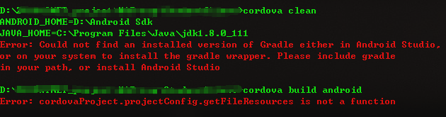

# cordova build android时Error: cordovaProject.projectConfig.getFileResources is not a function的解决
 
错误如下
   

原因似乎是cordova-android6.2.0本身的问题，删除掉之前的android，在添加新平台时指定版本号为6.1.2即可：

> cordova platform rm android

> cordova platform add android@6.1.2

