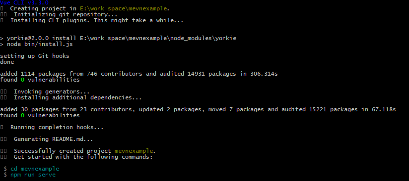
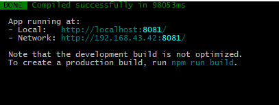
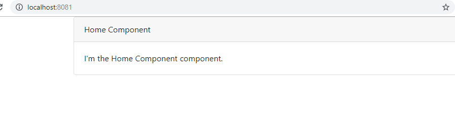
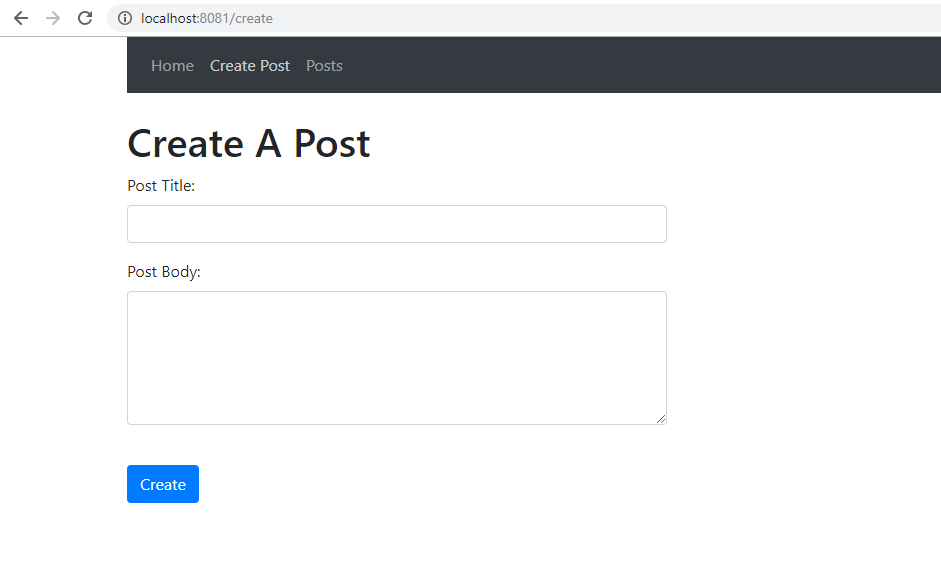
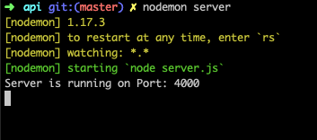

# MEVN Stack Tutorial From Scratch for the beginner
<br/>

[SOURCE](https://www.codermen.com/blog/81/mevn-stack-tutorial-from-scratch-for-the-beginner)

MEVN Stack Tutorial From Scratch is today topic, We will generate FullStack Single Page Application(SPA) using Mongo, MongoDB, Express, Vue, and Node 

In this post, we learn a simple CRUD operation where the user can create, read, delete and update some data.so let us start the MEVN Stack Tutorial From Scratch for the beginner.

## MEVN Stack Tutorial From Scratch for beginner

Before start tutorials, we need to first install Vue.js project using Vue CLI and for install CLI we need Node.js (version 8.9 or above  8.11.0+ recommended)

Run the following command to install Vue CLI, if you have not installed in your machine.

> npm install -g @vue/cli 

OR 

> yarn global add @vue/cli 

After successfully install you can check the version is Vue js using this command.
> vue --version

## Step: 1 Create a new Vue.js project
Run this following command to install Vue.js.
> vue create mevnproject

It takes some time to depend on your internet speed.
 

Now, go to your Vue js project folder and run following command.
> cd mevnexample

After that start the Vue js dev server using the following command. 
> npm run serve

Now, open project file in your favorite code editor.
  

Go to the http://localhost:8081 URL  on your browser.

## Step:2  Install Vue dependencies.
We install two dependencies one is **vue-router** and **vue-axios**.

* **Vue-router** :  Vue router use for routing in our Vue js applicaion.
* **Vue-axios** :  V-axios use for sending the network request severe.

Install this dependency using following this command.
> npm install axios vue-router vue-axios --save

In this Vue application, we use the bootstrap framework for styling. to install bootstrap run this command.
> npm install bootstrap --save

Now import bootstrap file in main.js
```js
 // main.js

import Vue from 'vue'
import App from './App.vue'
import 'bootstrap/dist/css/bootstrap.min.css'

Vue.config.productionTip = false

new Vue({
  render: h => h(App),
}).$mount('#app')
```

## Step 3: Create some components in Vue js 
In **src/components** folder create four new following components.

1. HomeComponent.vue
2. CreateComponent.vue
3. EditComponent.vue
4. IndexComponent.vue


Now, add some view code inside the **HomeComponent.vue** file.
```vue
<template>
<div class="row justify-content-center">
    <div class="col-md-8">
        <div class="card card-default">
            <div class="card-header">Home Component</div>

            <div class="card-body">
                I'm the Home Component component.
            </div>
        </div>
    </div>
</div>
</template>
<script>
export default {
}
</script>
```

After adding this component we need to import the **HomeComponent.vue** file inside the **App.vue** file.

Visit http://localhost:8081/ to see **HomeComponents** rendering.
 

Now create other three components.
### CreatComponent.vue
```vue
<template>
<div class="row justify-content-center">
    <div class="col-md-8">
        <div class="card card-default">
            <div class="card-header">Create Component</div>

            <div class="card-body">
                I'm the Create Component component.
            </div>
        </div>
    </div>
</div>
</template>

<script>
export default {
}
</script>
```
### EditComponent.vue
```vue
// EditComponent.vue
<template>
<div class="row justify-content-center">
    <div class="col-md-8">
        <div class="card card-default">
            <div class="card-header">Edit Component</div>

            <div class="card-body">
                I'm an Edit component.
            </div>
        </div>
    </div>
</div>
</template>

<script>
export default {
}
</script>
```
### IndexComponent.vue
```vue
// IndexComponent.vue
<template>
<div class="row justify-content-center">
    <div class="col-md-8">
        <div class="card card-default">
            <div class="card-header">Index Component</div>

            <div class="card-body">
                I'm an Index component.
            </div>
        </div>
    </div>
</div>
</template>

<script>
export default {
}
</script>
```

## Step:4 Configure the Vue-router
Now, configure Vue router. Inside the **main.js** file, write the following code for the route.
```js
// main.js
import Vue from 'vue'
import App from './App.vue'
import 'bootstrap/dist/css/bootstrap.min.css'

import VueRouter from 'vue-router';
Vue.use(VueRouter);

Vue.config.productionTip = false;

import HomeComponent from './components/HomeComponent.vue';
import CreateComponent from './components/CreateComponent.vue';
import IndexComponent from './components/IndexComponent.vue';
import EditComponent from './components/EditComponent.vue';

const routes = [
  {
      name: 'home',
      path: '/',
      component: HomeComponent
  },
  {
      name: 'create',
      path: '/create',
      component: CreateComponent
  },
  {
      name: 'posts',
      path: '/posts',
      component: IndexComponent
  },
  {
      name: 'edit',
      path: '/edit/:id',
      component: EditComponent
  }
];

const router = new VueRouter({ mode: 'history', routes: routes});

new Vue(Vue.util.extend({ router }, App)).$mount('#app');
```

Here, first import the Vue-router module and create an array for the route which has a **name**, **path**, and **components** as the properties.

After that, we have created the router object and passed the mode history and routes array.

Now, the at the last step is to define the `<router-view></router-view>` element in the view. It renders the component according to the routing path in our Vue application.

So, add the `<router-view>` inside the **App.vue** file.

```vue
// App.vue

<template>
  <div>
    <router-view></router-view>
  </div>
</template>

<script>


export default {
  name: 'app'
}
</script>
```

Now, save the file and check the following route paths.

1. http://localhost:8080/create
2. http://localhost:8080/posts
3. http://localhost:8080/edit/1

## Step:4 Create nav-bar for Vue application.
Write the following code inside the **App.vue** file for Nav bar.
```vue
// App.vue

<template>
  <div class="container">
    <nav class="navbar navbar-expand-sm bg-dark navbar-dark">
      <ul class="navbar-nav">
        <li class="nav-item">
          <router-link to="/" class="nav-link">Home</router-link>
        </li>
        <li class="nav-item">
          <router-link to="/create" class="nav-link">Create Post</router-link>
        </li>
        <li class="nav-item">
          <router-link to="/posts" class="nav-link">Posts</router-link>
        </li>
      </ul>
    </nav><br />
    <transition name="fade">
      <router-view></router-view>
    </transition>
  </div>
</template>

<style>
   
</style>

<script>

    export default{
    }
</script>
```

Here we add some code navigation bar for Vue application.

## Step:6 Create a form in CreateComponent.vue
We need a simple form for submitting data. so let's create a form in **CreateComponent.vue**
```vue
// CreateComponent.vue

<template>
  <div>
    <h1>Create A Post</h1>
    <form @submit.prevent="addPost">
      <div class="row">
        <div class="col-md-6">
          <div class="form-group">
            <label>Post Title:</label>
            <input type="text" class="form-control" v-model="post.title">
          </div>
        </div>
        </div>
        <div class="row">
          <div class="col-md-6">
            <div class="form-group">
              <label>Post Body:</label>
              <textarea class="form-control" v-model="post.body" rows="5"></textarea>
            </div>
          </div>
        </div><br />
        <div class="form-group">
          <button class="btn btn-primary">Create</button>
        </div>
    </form>
  </div>
</template>

<script>
    export default {
        data(){
        return {
          post:{}
        }
    },
    methods: {
      addPost(){
        console.log(this.post);
      }
    }
  }
</script>
```

First, at the bottom of the code, we define the object **post** here use used two-way data binding the post object has two properties title and body.

Second, we create one method called **addPost()**. when the user submits form details we will receive inside the **addPost()**  method. we will send a POST method request to the Laravel server and to save the data into the database.

Save all files and go to this URL: **http://localhost:8080/create** You can see the form like below. 

 

## Step: 7 Create a Node.js backend
Create a new folder inside the Vue project root called **API** and go inside that new folder.

And now, initialize the **package.json** file. 
> npm init -y

After running this command inside the new folder a new file auto created named **package.json**.

```
{
  "name": "api",
  "version": "1.0.0",
  "description": "",
  "main": "index.js",
  "scripts": {
    "test": "echo \"Error: no test specified\" && exit 1"
  },
  "keywords": [],
  "author": "",
  "license": "ISC"
}
```

After that install the following **node.js** dependencies.  using the following command.
> yarn add express body-parser cors mongoose

or

> npm install express body-parser cors mongoose --save

We need to also install **Nodemon serve** as a development dependency. because we do not need to restart every time, we change our server code.e change our server code.

> npm install nodemon --save-dev

Now we need to create some files called 

1. server.js
2. DB.js
3. post.model.js
4. post.route.js. 

All these files should be inside the root of the **API** folder. and write the following code inside the **server.js** file.
```js
// server.js

const express = require('express');
const app = express();
const bodyParser = require('body-parser');
const PORT = 4000;
const cors = require('cors');

app.use(cors());
app.use(bodyParser.urlencoded({extended: true}));
app.use(bodyParser.json());

app.listen(PORT, function(){
  console.log('Server is running on Port:',PORT);
});
```

After that, we need to start a node server using the following command.
> nodemon server

After running the command, our node.js server is running at port: **4000**

 

## Step:8 install and connect with MongoDB Database

Install MongoDB in your computer system. here I am just using the terminal for this demo because it is a simple application.

> mongod

Inside the API, folder creates a new file **DB.js** for connecting our node application with MongoDB, so this following code inside the **DB.js**.
```js
// DB.js

module.exports = {
    DB: 'mongodb://localhost:27017/mevncrud'
}
```

For the local MongoDB server, username and password may be empty. but when we create a production database we need to set all this thing.

Now, import this **DB.js** file into the **server.js** file.
```js
// server.js

const express = require('express');
const app = express();
const bodyParser = require('body-parser');
const PORT = 4000;
const cors = require('cors');
const mongoose = require('mongoose');
const config = require('./DB.js');

mongoose.Promise = global.Promise;
mongoose.connect(config.DB, { useNewUrlParser: true }).then(
  () => {console.log('Database is connected') },
  err => { console.log('Can not connect to the database'+ err)}
);

app.use(cors());
app.use(bodyParser.urlencoded({extended: true}));
app.use(bodyParser.json());

app.listen(PORT, function(){
  console.log('Server is running on Port:',PORT);
});
```
Now, our application connects with MongoDB Database.

## Step:9 Create a Mongoose Schema
Add some code inside the **post.model.js**
```js
// post.model.js

const mongoose = require('mongoose');
const Schema = mongoose.Schema;

// Define collection and schema for Post
let Post = new Schema({
  title: {
    type: String
  },
  body: {
    type: String
  }
},{
    collection: 'posts'
});

module.exports = mongoose.model('Post', Post);
```

## Step:10 Create Routes for Node.js application
Here we add CRUD operation code inside the **post.route.js** file.
```js
// post.model.js

const express = require('express');
const postRoutes = express.Router();

// Require Post model in our routes module
let Post = require('./post.model');

// Defined store route
postRoutes.route('/add').post(function (req, res) {
  let post = new Post(req.body);
  post.save()
    .then(() => {
      res.status(200).json({'business': 'business in added successfully'});
    })
    .catch(() => {
      res.status(400).send("unable to save to database");
    });
});

// Defined get data(index or listing) route
postRoutes.route('/').get(function (req, res) {
    Post.find(function(err, posts){
    if(err){
      res.json(err);
    }
    else {
      res.json(posts);
    }
  });
});

// Defined edit route
postRoutes.route('/edit/:id').get(function (req, res) {
  let id = req.params.id;
  Post.findById(id, function (err, post){
      if(err) {
        res.json(err);
      }
      res.json(post);
  });
});

//  Defined update route
postRoutes.route('/update/:id').post(function (req, res) {
    Post.findById(req.params.id, function(err, post) {
    if (!post)
      res.status(404).send("data is not found");
    else {
        post.title = req.body.title;
        post.body = req.body.body;
        post.save().then(() => {
          res.json('Update complete');
      })
      .catch(() => {
            res.status(400).send("unable to update the database");
      });
    }
  });
});

// Defined delete | remove | destroy route
postRoutes.route('/delete/:id').delete(function (req, res) {
    Post.findByIdAndRemove({_id: req.params.id}, function(err){
        if(err) res.json(err);
        else res.json('Successfully removed');
    });
});

module.exports = postRoutes;
```

Inside the post model js, we write the CRUD operation in Node.js which is back end server side. so when a user requests from the clientside hits the node express server and the above function will be executed and all request sends to the database and send the response to the client, in this application we use vue.js as frontend.

We use MongoDB ORM to CRUD operation from the MongoDB database. **Mongoose** is an **ORM(Object Relational Mapping)** which is used in **the MongoDB** database. Now, we have all setup for the CRUD operations set up on the **post.route.js** file. we need to import inside the **server.js** file.

So, our finally **server.js** file looks like this.
```js
// server.js

const express = require('express');
const app = express();
const bodyParser = require('body-parser');
const PORT = 4000;
const cors = require('cors');
const mongoose = require('mongoose');
const config = require('./DB.js');
const postRoute = require('./post.route');

mongoose.Promise = global.Promise;
mongoose.connect(config.DB, { useNewUrlParser: true }).then(
  () => { console.log('Database is connected') },
  err => { console.log('Can not connect to the database'+ err)}
);

app.use(cors());
app.use(bodyParser.urlencoded({extended: true}));
app.use(bodyParser.json());

app.use('/posts', postRoute);

app.listen(PORT, function(){
  console.log('Server is running on Port:',PORT);
});
```

## Step:12 Use Axios to send a network request
Import the **axios** and **vue-axios** in the **main.js** file.
```js
// main.js

import Vue from 'vue'
import App from './App.vue'
import 'bootstrap/dist/css/bootstrap.min.css'

import VueRouter from 'vue-router';
Vue.use(VueRouter);

import VueAxios from 'vue-axios';
import axios from 'axios';

Vue.use(VueAxios, axios);

Vue.config.productionTip = false;

import HomeComponent from './components/HomeComponent.vue';
import CreateComponent from './components/CreateComponent.vue';
import IndexComponent from './components/IndexComponent.vue';
import EditComponent from './components/EditComponent.vue';

const routes = [
  {
      name: 'home',
      path: '/',
      component: HomeComponent
  },
  {
      name: 'create',
      path: '/create',
      component: CreateComponent
  },
  {
      name: 'posts',
      path: '/posts',
      component: IndexComponent
  },
  {
      name: 'edit',
      path: '/edit/:id',
      component: EditComponent
  }
];

const router = new VueRouter({ mode: 'history', routes: routes});

new Vue(Vue.util.extend({ router }, App)).$mount('#app');
```

We have created the backend. Next step is to send the **POST method** request to the node.js API server. Remember, now we have three servers are running.

1. Vue development server
2. Node.js server
3. MongoDB server

Make sure, all these running fine otherwise the project won’t work.

Write some code code inside the **CreateComponent.vue** file’s **addPost()** function.
```js
// CreateComponent.vue

addPost(){
    let uri = 'http://localhost:4000/posts/add';
    this.axios.post(uri, this.post).then(() => {
       this.$router.push({name: 'posts'});
    });
}
```
Now we can create the post and see in the MongoDB database.

To check by the terminal, you need to open the mongo shell using the following command.
> mongo

## Step:12 Display the backend data
After saving a row of data into database we want to display. so write some code inside the **IndexComponent.vue**
```vue
// IndexComponent.js

<template>
  <div>
      <h1>Posts</h1>
        <div class="row">
          <div class="col-md-10"></div>
          <div class="col-md-2">
            <router-link :to="{ name: 'create' }" class="btn btn-primary">Create Post</router-link>
          </div>
        </div><br />

        <table class="table table-hover">
            <thead>
            <tr>
              <th>Title</th>
              <th>Body</th>
              <th>Actions</th>
            </tr>
            </thead>
            <tbody>
                <tr v-for="post in posts" :key="post._id">
                  <td>{{ post.title }}</td>
                  <td>{{ post.body }}</td>
                  <td><router-link :to="{name: 'edit', params: { id: post._id }}" class="btn btn-primary">Edit</router-link></td>
                  <td><button class="btn btn-danger">Delete</button></td>
                </tr>
            </tbody>
        </table>
  </div>
</template>

<script>
  export default {
      data() {
        return {
          posts: []
        }
      },
      created() {
      let uri = 'http://localhost:4000/posts';
      this.axios.get(uri).then(response => {
        this.posts = response.data;
      });
    }
  }
</script>
```
Now you can see this inserted data on the browser.

## Step:13 Send edit and update request
Now, when we want to edit our data we need to fetch that record from data to display on view. Then, after editing the data in the **textbox** and **textarea**, when we hit the update button, **updatePost()** function to send a post request to the server to update the data.
```vue
// EditComponent.vue

<template>
  <div>
    <h1>Edit Post</h1>
    <form @submit.prevent="updatePost">
      <div class="row">
        <div class="col-md-6">
          <div class="form-group">
            <label>Post Title:</label>
            <input type="text" class="form-control" v-model="post.title">
          </div>
        </div>
        </div>
        <div class="row">
          <div class="col-md-6">
            <div class="form-group">
              <label>Post Body:</label>
              <textarea class="form-control" v-model="post.body" rows="5"></textarea>
            </div>
          </div>
        </div><br />
        <div class="form-group">
          <button class="btn btn-primary">Update</button>
        </div>
    </form>
  </div>
</template>

<script>
    export default {

      data() {
        return {
          post: {}
        }
      },
      created() {
        let uri = `http://localhost:4000/posts/edit/${this.$route.params.id}`;
        this.axios.get(uri).then((response) => {
            this.post = response.data;
        });
      },
      methods: {
        updatePost() {
          let uri = `http://localhost:4000/posts/update/${this.$route.params.id}`;
          this.axios.post(uri, this.post).then(() => {
            this.$router.push({name: 'posts'});
          });
        }
      }
    }
</script>
```
After changing the database we can see the edit data from the database and also you can update the database.

## Step:14 Delete the data
So, add some final code inside the **IndexComponent.vue** file for delete a record.
```vue
// IndexComponent.vue

<template>
  <div>
      <h1>Posts</h1>
        <div class="row">
          <div class="col-md-10"></div>
          <div class="col-md-2">
            <router-link :to="{ name: 'create' }" class="btn btn-primary">Create Post</router-link>
          </div>
        </div><br />

        <table class="table table-hover">
            <thead>
            <tr>
              <th>Title</th>
              <th>Body</th>
              <th>Actions</th>
            </tr>
            </thead>
            <tbody>
                <tr v-for="post in posts" :key="post._id">
                  <td>{{ post.title }}</td>
                  <td>{{ post.body }}</td>
                  <td><router-link :to="{name: 'edit', params: { id: post._id }}" class="btn btn-primary">Edit</router-link></td>
                  <td><button class="btn btn-danger" @click.prevent="deletePost(post._id)">Delete</button></td>
                </tr>
            </tbody>
        </table>
  </div>
</template>

<script>
  export default {
      data() {
        return {
          posts: []
        }
      },
      created() {
      let uri = 'http://localhost:4000/posts';
      this.axios.get(uri).then(response => {
        this.posts = response.data;
      });
    },
    methods: {
      deletePost(id)
      {
        let uri = `http://localhost:4000/posts/delete/${id}`;
        this.axios.delete(uri).then(response => {
          this.posts.splice(this.posts.indexOf(id), 1);
        });
      }
    }
  }
</script>
```
Save all file, and now, you can see delete the values from the **MongoDB** database.

**OVER**